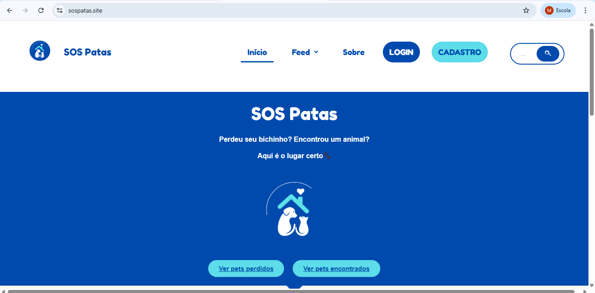
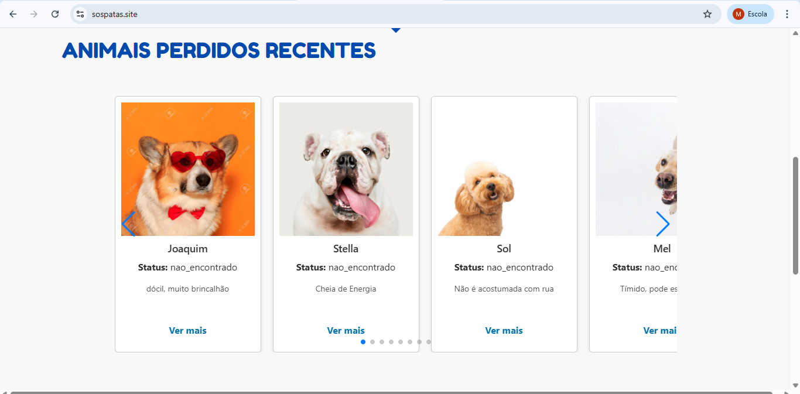
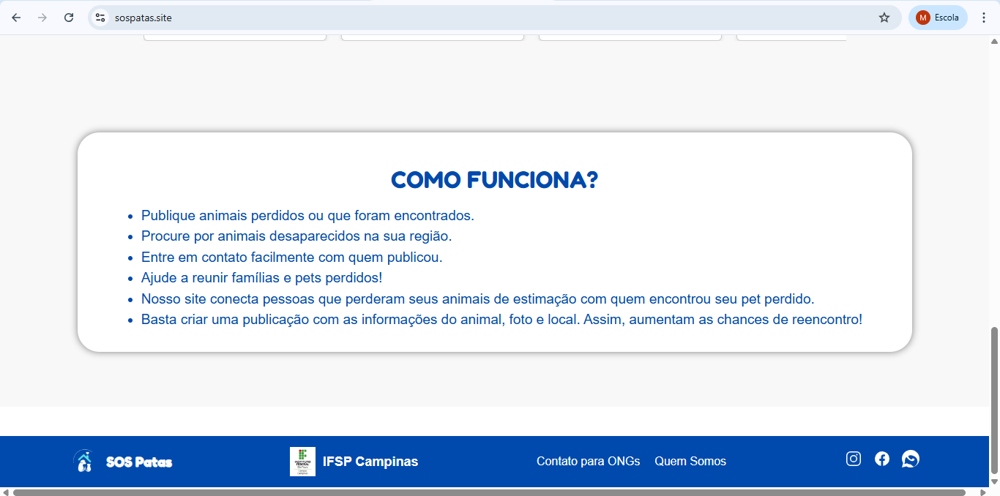
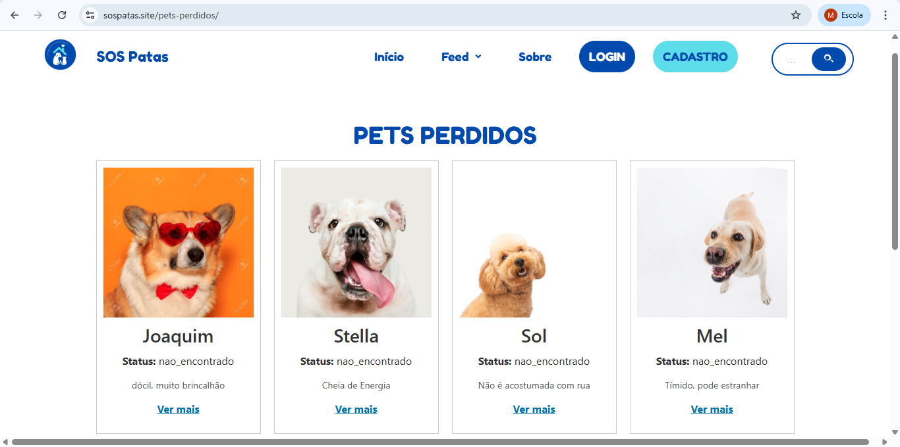
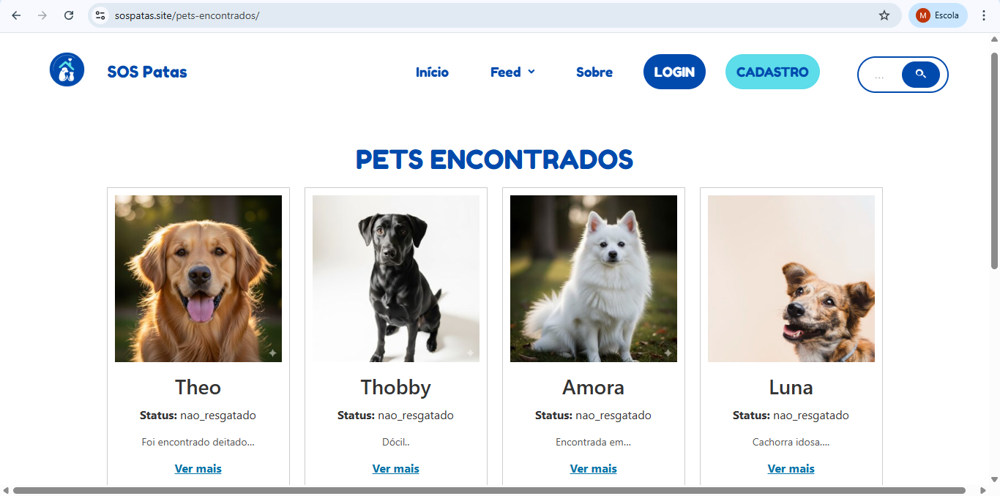
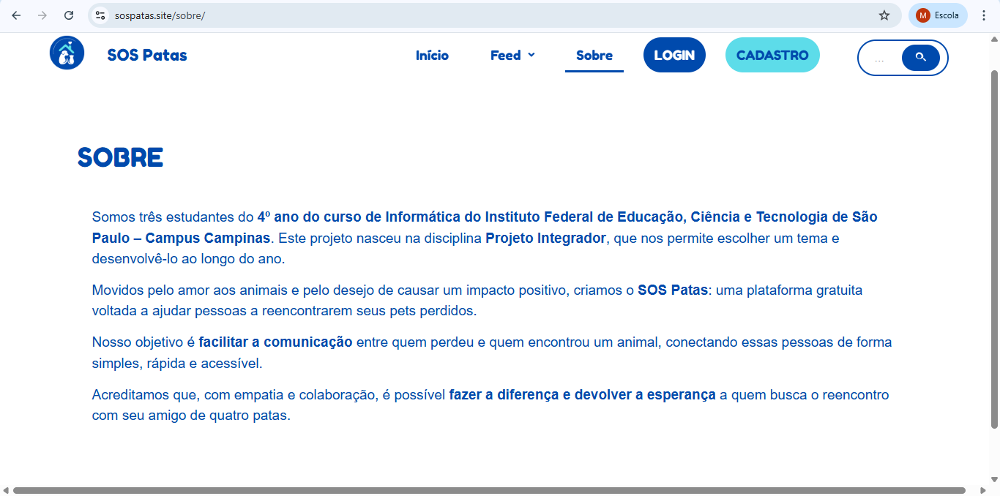
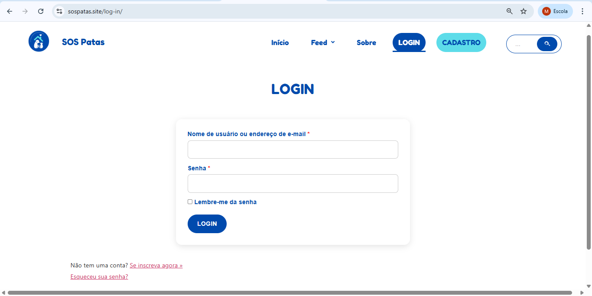
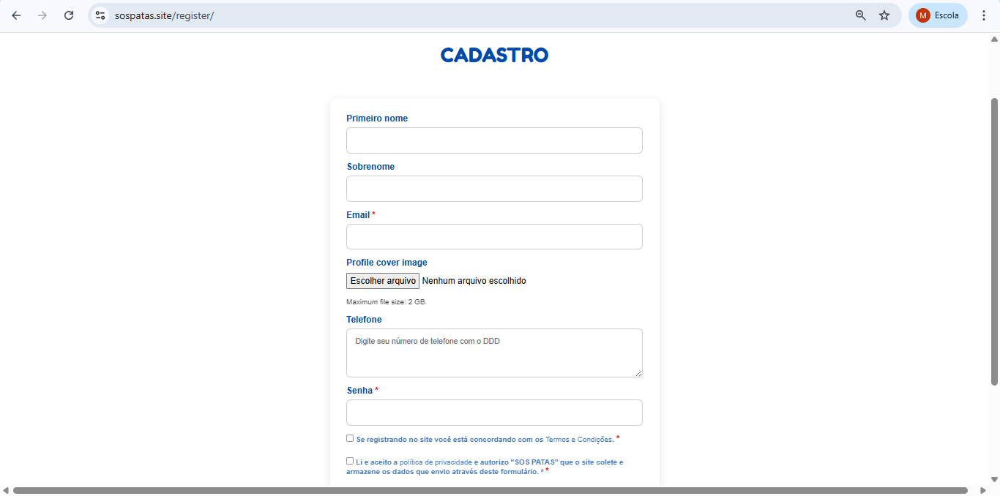
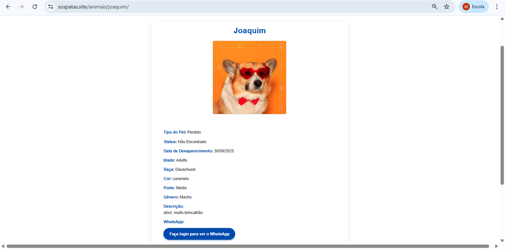

# 🐾 SOS Patas

## 📌 Sobre o projeto
O **SOS Patas** é um site desenvolvido com o objetivo de ajudar na **localização de animais perdidos**, facilitando a divulgação de informações e o contato entre tutores e a comunidade.

O projeto foi desenvolvido em **grupo**, os autores são Melissa Felix, Valentina Alves e Gabriel Vinicius.

> 🔧 **(Resultados:)**

O projeto SOS Patas foi aprovado e apresentado Bragantec 2025 – Feira de Ciências e Tecnologia do IFSP Câmpus Bragança Paulista, na Conict - Congresso de Inovação, Ciência e Tecnologia e na FECCIF - Feira Estadual de Ciência e Cultura do IFSP.

## 🎯 Objetivo do site
> ✏️ **O objetivo do site é ajudar os usuários a encontrar seu pet perdido, nossa plataforma é simples e fácil de usar.**

---

## 🛠️ Tecnologias utilizadas
- WordPress  
- HTML  
- CSS
- PHP
- JavaScript
- Plugins do WordPress  

## 🖼️ Telas do projeto

### Tela 1 – Home

### Tela 2 – Sobre

### Tela 3 – Funcionalidade principal

### Tela 4

### Tela 5

### Tela 6

### Tela 7

### Tela 8

### Tela 9

### Tela 10

## ⚠️ Observação
O código-fonte não está disponível neste repositório, pois o projeto foi desenvolvido em ambiente **WordPress compartilhado**, em trabalho colaborativo.
Link do nosso projeto: https://sospatas.site/

## 📬 Contato
> ✏️ **felixsantosmelissa@gmail.com**
