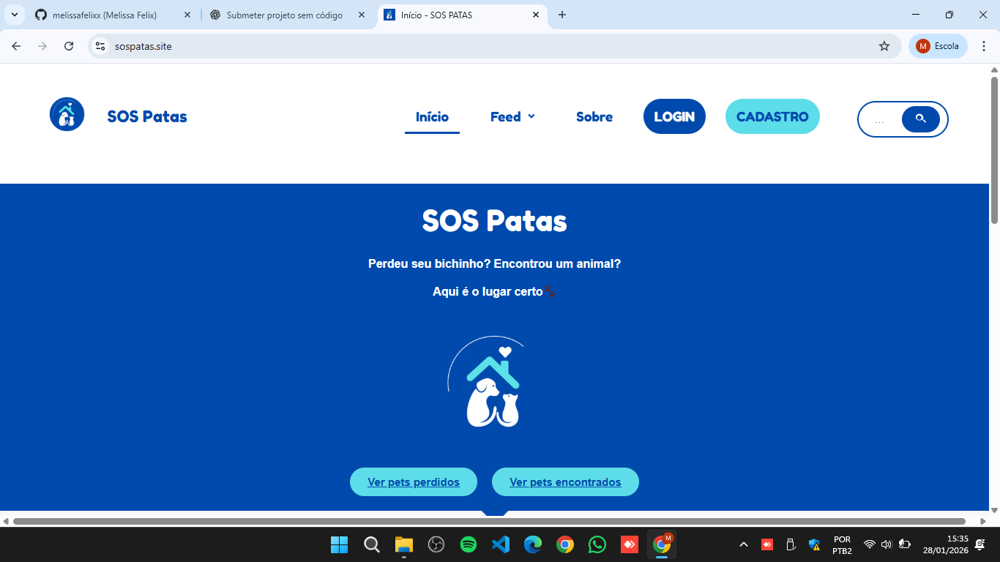
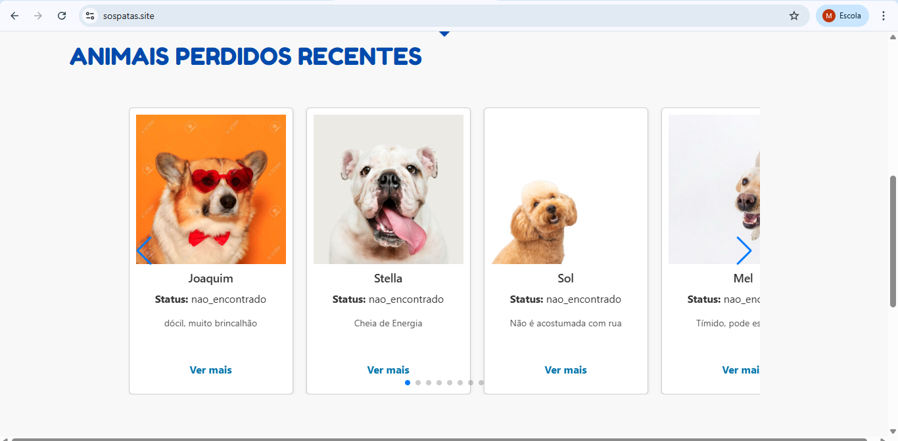
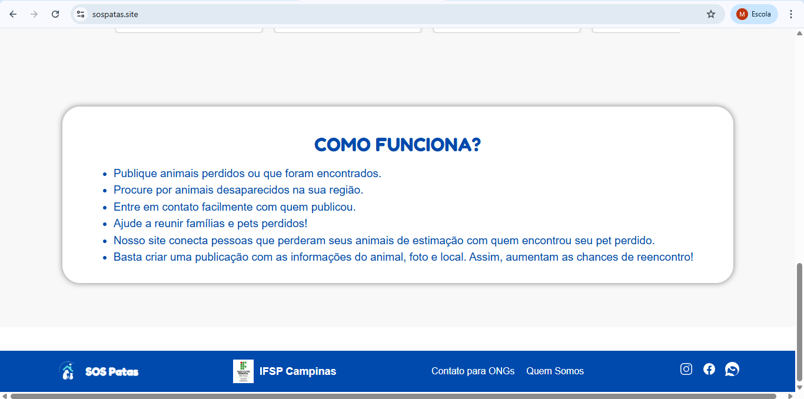
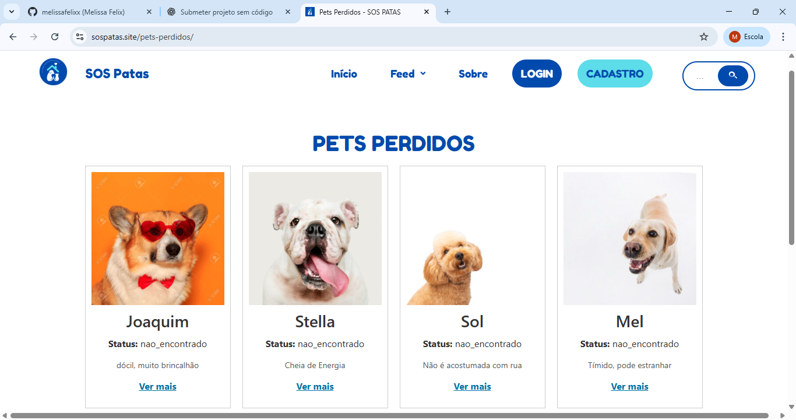
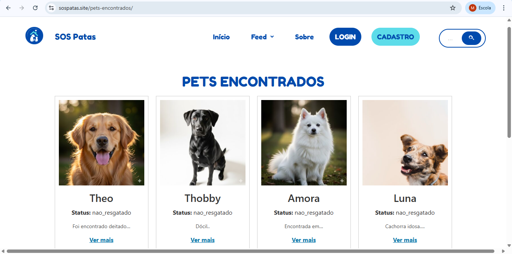
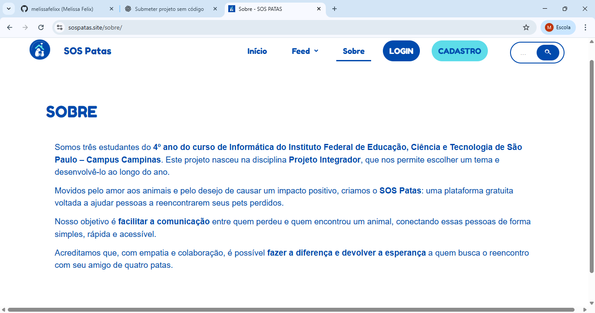
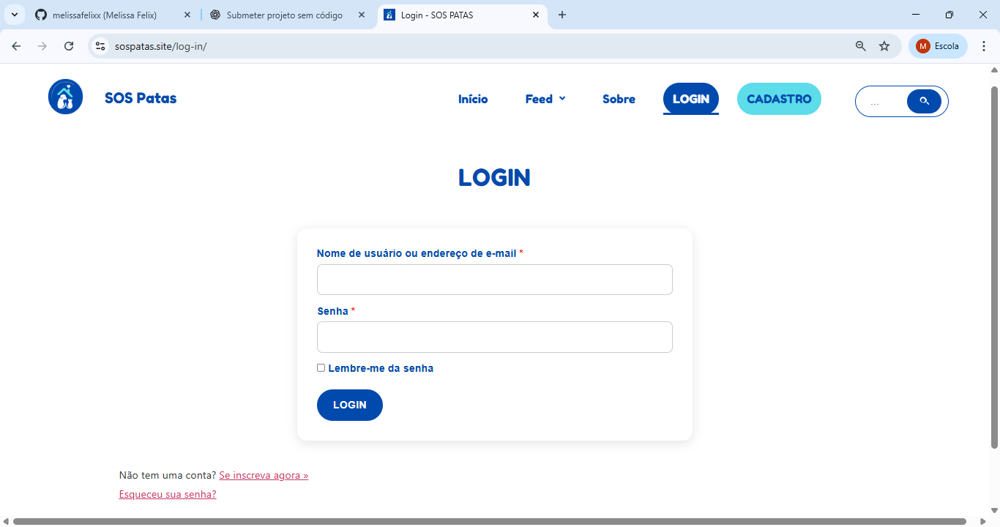
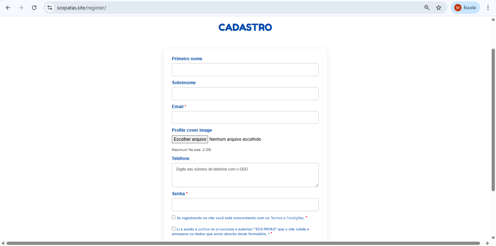
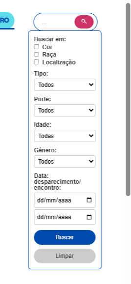
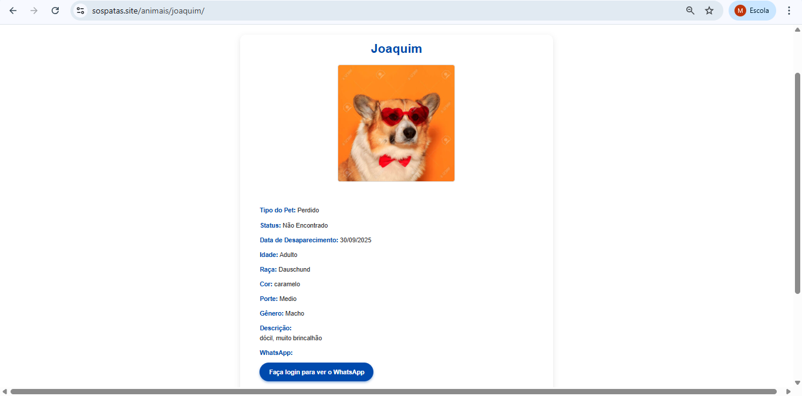

# 🐾 SOS Patas

## 📌 Sobre o projeto
O **SOS Patas** é um site desenvolvido com o objetivo de ajudar na **localização de animais perdidos**, facilitando a divulgação de informações e o contato entre tutores e a comunidade.

O projeto foi desenvolvido em **grupo**, os autores são Melissa Felix, Valentina Alves e Gabriel Vinicius.

> 🔧 **Resultados:**

O projeto SOS Patas foi aprovado e apresentado Bragantec 2025 – Feira de Ciências e Tecnologia do IFSP Câmpus Bragança Paulista, na Conict - Congresso de Inovação, Ciência e Tecnologia e na FECCIF - Feira Estadual de Ciência e Cultura do IFSP.

## 🎯 Objetivo do site
> ✏️ **O objetivo do site é ajudar os usuários a encontrar seus pets perdidos por meio de uma plataforma simples e fácil de usar.**

---

## 🛠️ Tecnologias utilizadas
- WordPress  
- HTML  
- CSS
- PHP
- JavaScript
- Plugins do WordPress  

## 🖼️ Telas do projeto

### Tela 1 – Home:

Tela inicial da plataforma.

### Tela 2 – Feed Automático:

O feed automático mostra os últimos pets cadastrados que foram perdidos recentemente.

### Tela 3 – Funcionalidade principal:

Apresenta as principais funcionalidades da plataforma.

### Tela 4 - Feed Pets Perdidos:

Feed dos animais perdidos que foram publicados.

### Tela 5- Feed Pets Encontrados:

Feed dos animais encontrados que foram publicados.

### Tela 6 - Sobre os Criadores:

Falando sobre os criadores do projeto e os objetivos.

### Tela 7 - Página do Login:

Página do login da plataforma. 

### Tela 8 - Cadastro:

Tela do cadastro do usuário caso não tenha conta.

### Tela 9 - Filtro de Busca:

O filtro de busca permite personalizar sua pesquisa.

### Tela 10 - Detalhe do Pet Cadastrado:

Mostra os detalhes do pet perdido. 

## ⚠️ Observação
O código-fonte não está disponível neste repositório, pois o projeto foi desenvolvido em ambiente **WordPress compartilhado**, em trabalho colaborativo.
Link do nosso projeto: https://sospatas.site/ (Desativado temporariamente)

## 📬 Contato
> ✏️ **felixsantosmelissa@gmail.com**
